# Prism Ideal Architecture (v1)

Prism is intentionally an **operations plane**, not a source-editing tool.  
The architecture below is the implementation contract for a tool that can let one operator govern very large estates with deterministic behavior.

## Core architectural pattern

- **Hexagonal (ports & adapters)** for clean boundaries:
  - `core` domain logic stays deterministic and side-effect free.
  - Infrastructure adapters own file, git, sqlite, signature, and external integrations.
- **Evented workflow state machine** for command execution:
  - each command moves run state through deterministic transitions.
- **Receipt-first command model**:
  - every mutating command writes a receipt before and after effects.
- **Offline-first + replayable**:
  - all outputs can be regenerated from inputs and policy fingerprints.

## Module decomposition

- `src/main.rs` (thin CLI dispatch)
  - Parses command intent and delegates to orchestrators.
  - No business logic.
- `src/app/`
  - `mod.rs`: command orchestration entry points.
  - `context.rs`: normalized command context and run metadata.
  - `error.rs`: typed error and deterministic reason codes.
  - `policy.rs`: strict/warn/off mode resolution and precedence.
- `src/domain/`
  - `snapshot.rs`: immutable repository state snapshot schema.
  - `signal.rs`: chirality of LensMap, git, ownership, and churn signals.
  - `score.rs`: deterministic score formulas + trace payload.
  - `task.rs`: task graph, dependencies, effort estimates.
  - `plan.rs`: bounded planning and stop conditions.
  - `gate.rs`: gate rules, blockers, release policy checks.
  - `incident.rs`: incident lifecycle and escalation state.
  - `handoff.rs`: handoff packet generation/import.
  - `health.rs`: SLO and drift telemetry.
- `src/engine/`
  - `refresh.rs`: ingest + sharded scan orchestration + checkpoints.
  - `prioritize.rs`: score ordering and deterministic merge.
  - `runner.rs`: `simulate`, `do`, rollback metadata capture.
  - `evidence.rs`: run receipts, ledger hooks, and envelope generation.
- `src/adapters/`
  - `lensmap.rs`: tolerant LensMap import adapter and signal mapping.
  - `git.rs`: changed-file and churn proxy adapter.
  - `fs.rs`: repo traversal, glob, and lock handling.
  - `store.rs`: sqlite + jsonl persistence adapters.
  - `connector/*.rs`: GitHub/GitLab/Jira/ServiceNow/Slack adapters.
- `src/http/` (optional v1.1)
  - API server exposing identical schemas as CLI output (no semantic drift).
- `src/crypto/`
  - `hash.rs`: digest normalization and run fingerprints.
  - `sign.rs`: signature metadata and optional verifier plumbing.

## Execution planes

1. **Signal Plane**
   - Sources: `.lensmap`, git metadata, ownership hints, changelog inputs.
   - Output: deterministic normalized signal set + `snapshot` artifact.

2. **Decision Plane**
   - Inputs: snapshot + policy profile.
   - Output: deterministic score + task graph + plan.

3. **Action Plane**
   - Validates enforcement, lock scope, and blast radius.
   - Executes dry-run by default; apply only with explicit confirmation token or flag.

4. **Evidence Plane**
   - Append-only receipts + run chain + retention tags.
   - Optional ledger/signature emission.

5. **Control Plane**
   - Policy federation, drift detection, health/report export, admission bundles.

## Determinism contract (non-negotiable)

- Same inputs must yield byte-stable outputs:
  - sorted task ordering,
  - stable JSON key order,
  - stable hash seeds and seed IDs.
- Checkpoint/retry must be idempotent:
  - repeated run with same snapshot + config + command path resumes to same checkpoint.
- Any command that changes state must emit:
  - input digest,
  - command identity,
  - policy profile hash,
  - receipt reference,
  - ledger anchor.

## Reference dataflow (implementable command order)

```mermaid
flowchart LR
  A["Command"] --> B["Context + Input Canonicalization"]
  B --> C["Signal Ingest"]
  C --> D["Deterministic Snapshot"]
  D --> E["Scoring + Trace Generation"]
  E --> F["Plan / Gate / Simulation"]
  F --> G["Policy Enforce"]
  G --> H["Action (dry-run|apply)"]
  H --> I["Receipt + Ledger + Health Event"]
  I --> J["Run Chain / Restore / Evidence Export"]
```

## Security and policy model

- Default behavior is non-blocking read mode.
- Mutating commands require role-gated authorization.
- `enforce` and `do` must use the same enforcement engine:
  - `pass` => execute,
  - `warn` => execute with marker,
  - `block` => refuse unless explicit emergency override + immutable override metadata.

## Suggested implementation sequence

1. Domain model + command envelopes (`BLK-001` to `BLK-007`).
2. Policy precedence + enforcement path (`BLK-011`, `BLK-021`).
3. Deterministic receipts + audit chain (`BLK-007`, `BLK-023`).
4. Resumability and drift/health (`BLK-008`, `BLK-019`, `BLK-028`).
5. Control-plane federation and external connectors (`BLK-024`, `BLK-025`, `BLK-036`).

This architecture is intended to be implemented directly in phases matching the existing backlog IDs.
